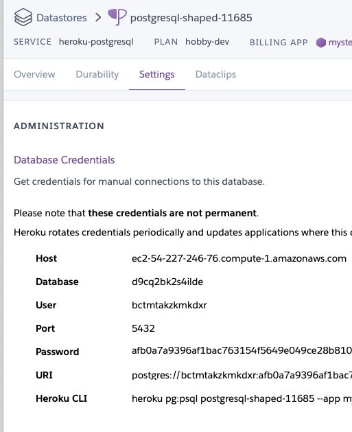
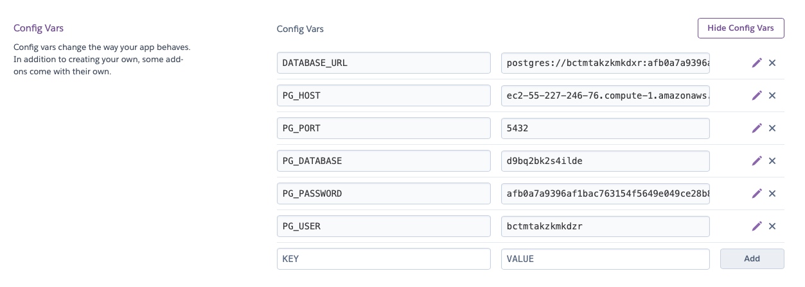
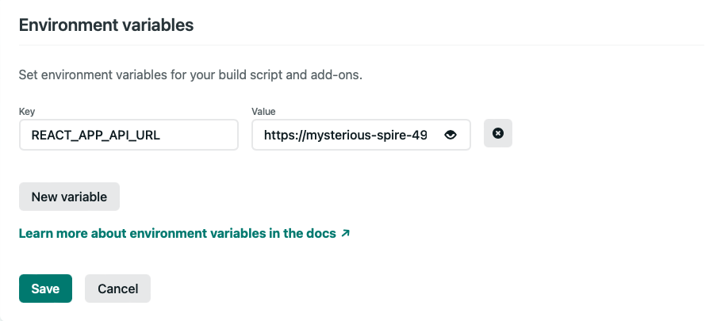
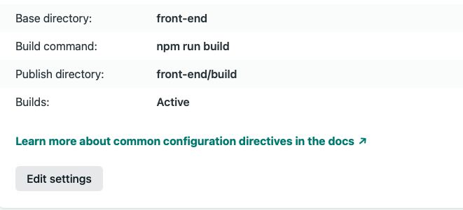

# Full-Stack Portfolio Project: Solemates

	Netlify Deployment: https://zippy-panda-214a2c.netlify.app/

	Heroku Deployment: https://fast-woodland-00564.herokuapp.com/
  
  	Trello Board: https://trello.com/b/leYWy6Ak/solemates
  
	Miro Wireframes: https://miro.com/app/board/uXjVPbmRoHM=/

# Solemates

An app where you can enter an article of clothing - a hat, t-shirt, jacket, coat (headwear or top) - and find footwear that will match the colorway you have chosen. (Coming Soon: Along with the budget and shoesize, you will receive recommendations && pricing from four (4) of the top reseller websites, including GOAT, StockX, Stadium Goods, FlightClub. Come & find your Solemate).


In order to run:

**NOTE:** - You will have 3 `package.json` files in this project

- **Top level** - necessary for heroku deployment: you don't need to do anything with this file, it is set up for you
- **back-end** - everything to do with the express/postgres backend
- **front-end** - everything to do with the create-react-app front-end

### `back-end` Set Up and Deployment to Heroku

**/back-end**

- `cd back-end`
- `npm install`

make sure you are on the same level as the `package.json` of the `back-end` directory
- `touch .env`

```
PORT=3333
PG_HOST=localhost
PG_PORT=5432
PG_DATABASE=postgres
PG_USER=postgres
```

When ready, make sure the terminal is on the back-end and enter commands in order:

- `heroku create`
- `git add .`
- `git commit -m 'heroku deployment`
- `git push heroku main` - if this does not work, go to heroku dashboard => deployment and add the remote

Open your heroku app. You should see the `Find Your Solemate!` message.

#### Adding the Database on Heroku

In the heroku dashboard, go to `Overview` choose `configure add ons`

In the search bar `Quickly add add-ons` - search for `postgres` - choose `heroku postgres`

- Choose hobby dev
- Click on `heroku Postgres / attached as DATABASE` => Settings



- Open a new tab/window and go to the main page of your heroku app choose settings
- Reveal Config Variables
- Add the variables

**Note:** these are false credentials and given for example only:

```
PG_HOST=ec2-55-227-246-76.compute-1.amazonaws.com
PG_PORT=5432
PG_DATABASE=d9bq2bk2s4ilde
PG_USER=bcwmtakzkmkdxr
PG_PASSWORD=afb0a7a9396af1bac763154f5649e049ce280658bef0ded7efde6
```



- make sure you are on the same directory level as your `package.json` of your `back-end` directory

Go back to the heroku database view => settings

- copy `Heroku CLI` (something like `heroku pg:psql postgresql-shaped-11685 --app mysterious-spires-49488`)
- paste into your terminal
- it should open a `pg shell` with the last word as "DATABASE=>"

Run the following:

- update the `\i ./db/prod_schema.sql` with the PG_DATABASE value from Heroku
- `\i ./db/prod_schema.sql`
  - success should say `CREATE TABLE`
- update the `\i ./db/prod_seed.sql` with the PG_DATABASE value from Herkou
- `\i ./db/prod_seed.sql`
  - success should say `INSERT 0 6`
- `\q`

### `front-end` Set Up

**/front-end**

- `cd front-end`
- `npm instal`
- `touch .env`

Replace the URL given with your new heroku URL

**.env**

EXAMPLE:
```
REACT_APP_API_URL=https://mysterious-spire-49483.herokuapp.com
```

- `npm start`

Make sure your back-end is still running. You should see a grid containing articles of clothing, coming from your back-end. If it does not work locally, it will not work when it is deployed.

Go to netlify, choose `New site from Git`, OR Add New Site -> Import an existing project -> Click on GitHub logo -> Search for the repository containing your front-end.

Follow the prompts to add this project repo to Netlify
Once, authorized, configure to launch app from:

- Base directory: `front-end`
- Build command: `npm run build`
- Publish directory: `build` (may appear as `front-end/build`)
- add the environmental variable





Note: if you were starting your own create-react-app from scratch, in order to use react-router, you would need to add the file `_redirects` to `/public`

The content of the `_redirects` file should be

```
/* /index.html 200
```

[Best Guide](https://github.com/joinpursuit/pern-final-project-template)
